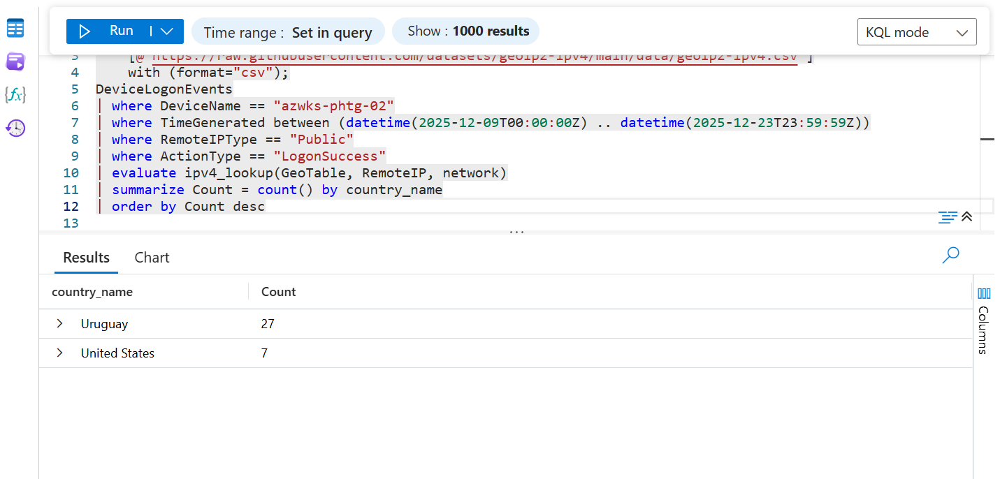

# Threat Hunt Executive Report
## Incident: PHTG External RDP Compromise


> **Target Environment:** PHTG Azure Infrastructure (HealthCloud Deployment)  
> **Compromised Asset:** azwks-phtg-02 (Windows 10 Enterprise)  
> **Initial Access Vector:** Exposed Public RDP via OSINT Leak  
> **Malware Family:** Trojan:Win32/Meterpreter.RPZ!MTB
---

### Executive Summary
In December 2025, PHTG suffered a targeted ransomware attack resulting from a critical operational security (OpSec) failure. A cloud engineer posted a workstation screenshot to LinkedIn, inadvertently exposing the Azure management portal, the target virtual machine hostname (`AZwks-phtf-02`), and its public IP address (`74.249.82.162`). 

Threat actors leveraged this actionable exposure to conduct distributed RDP scanning and credential stuffing across 17 countries. The attacker successfully compromised the highly privileged `vmadminusername` account using infrastructure based in Uruguay. After gaining interactive access, the threat actor conducted internal reconnaissance, forced Microsoft Defender into Passive Mode to bypass EDR, and deployed a Meterpreter payload disguised as legitimate HealthCloud infrastructure. The attack culminated in the establishment of persistent Command & Control (C2) and ransomware execution.

---

## Chronological Attack Timeline & Telemetry Evidence

### Phase 1: Pre-Incident Reconnaissance & Public Exposure
* **The Exposure:** A LinkedIn photo leak revealed a cloud engineer managing infrastructure. The screenshot exposed the VM's public IP address (`74.249.82.162`). 
* **The Risk:** A public IP directly associated with a VM creates an actionable attack surface for external actors, bypassing perimeter firewalls.

### Phase 2: Dec 9 – Dec 10, 2025 | Network Scanning & Enumeration
Automated internet scanners immediately targeted the exposed RDP port (3389). We analyzed inbound connection volume to distinguish raw internet noise from targeted probing.
* **Volume:** 194 inbound connection events originated from external sources hitting port 3389. (Internal noise inflated this to 325 before filtering for public IPs).
* **Unique Actors:** 173 unique public IP addresses targeted the service.
* **TCP Handshakes:** 57 of these IPs successfully established a TCP handshake spanning 11 distinct countries, confirming distributed botnet scanning.

**KQL Query: Port Scanning Volume by Local Port**
```kusto
DeviceNetworkEvents
| where DeviceName == "azwks-phtg-02"
| where TimeGenerated between (datetime(2025-12-09T00:00:00Z) .. datetime(2025-12-23T23:59:59Z))
| where ActionType in ("InboundConnectionAccepted", "ConnectionAttempt")
| summarize Count = count() by LocalPort
| order by Count desc
```

**KQL Query: External RDP Event Count (Public IPs Only)**
```kusto
DeviceNetworkEvents
| where DeviceName == "azwks-phtg-02"
| where TimeGenerated between (datetime(2025-12-09T00:00:00Z) .. datetime(2025-12-23T23:59:59Z))
| where LocalPort == 3389
| where RemoteIPType == "Public"
| count
```

**KQL Query: Unique Public IPs**
```kusto
DeviceNetworkEvents
| where DeviceName == "azwks-phtg-02"
| where TimeGenerated between (datetime(2025-12-09T00:00:00Z) .. datetime(2025-12-23T23:59:59Z))
| where LocalPort == 3389
| where RemoteIPType == "Public"
| summarize dcount(RemoteIP)
```

**KQL Query: Isolating Successful TCP Handshakes & Geographic Enrichment**
```kusto
let GeoTable = externaldata(network:string, geoname_id:long, continent_code:string,
                 continent_name:string, country_iso_code:string, country_name:string)
    [@"https://raw.githubusercontent.com/datasets/geoip2-ipv4/main/data/geoip2-ipv4.csv"]
    with (format="csv");
let Attempts = DeviceNetworkEvents
| where DeviceName == "azwks-phtg-02"
| where TimeGenerated between (datetime(2025-12-09T00:00:00Z) .. datetime(2025-12-23T23:59:59Z))
| where LocalPort == 3389 
| where ActionType == "ConnectionAttempt" 
| distinct RemoteIP;
let Accepted = DeviceNetworkEvents
| where DeviceName == "azwks-phtg-02"
| where TimeGenerated between (datetime(2025-12-09T00:00:00Z) .. datetime(2025-12-23T23:59:59Z))
| where LocalPort == 3389 
| where ActionType == "InboundConnectionAccepted" 
| distinct RemoteIP;
Attempts
| join kind=inner Accepted on RemoteIP
| evaluate ipv4_lookup(GeoTable, RemoteIP, network)
| summarize dcount(country_name)
```
> 
> *Displays the volume of connection attempts vs. accepted connections on the target asset.*

### Phase 3: Dec 10 – Dec 11, 2025 | Authentication & Brute Force Compromise
Attackers escalated from scanning to active credential stuffing against the RDP service (intercepted via Network Level Authentication - NLA).
* **Baseline Volume:** 675 external RDP auth events (667 Network logons + 8 RemoteInteractive).
* **The Funnel:** 646 attempts failed due to `InvalidUserNameOrPassword` across 17 countries. Only 2 countries succeeded: United States and **Uruguay**.
* **The Breach:** Uruguay was identified as the anomalous country, as PHTG has no international presence. The attacker successfully brute-forced the `vmadminusername` account.
* **Attacker Infrastructure:** The breach originated from a dedicated /28 proxy/VPN subnet in Uruguay: `173.244.55.131` and `173.244.55.128`.

**KQL Query: External Auth Attempts by Logon Type**
```kusto
DeviceLogonEvents
| where DeviceName == "azwks-phtg-02"
| where TimeGenerated between (datetime(2025-12-09T00:00:00Z) .. datetime(2025-12-23T23:59:59Z))
| where RemoteIPType == "Public"
| summarize Count = count() by LogonType
```
> 
> *Highlights the distribution of LogonType events, isolating interactive and network authentication attempts.*

**KQL Query: Logon Outcomes (Success vs. Failure)**
```kusto
DeviceLogonEvents
| where DeviceName == "azwks-phtg-02"
| where TimeGenerated between (datetime(2025-12-09T00:00:00Z) .. datetime(2025-12-23T23:59:59Z))
| where RemoteIPType == "Public"
| summarize Count = count() by ActionType
```

**KQL Query: Countries Behind Successful Logins**
```kusto
let GeoTable = externaldata(network:string, geoname_id:long, continent_code:string,
                 continent_name:string, country_iso_code:string, country_name:string)
    [@"https://raw.githubusercontent.com/datasets/geoip2-ipv4/main/data/geoip2-ipv4.csv"]
    with (format="csv");
DeviceLogonEvents
| where DeviceName == "azwks-phtg-02"
| where TimeGenerated between (datetime(2025-12-09T00:00:00Z) .. datetime(2025-12-23T23:59:59Z))
| where RemoteIPType == "Public"
| where ActionType == "LogonSuccess"
| evaluate ipv4_lookup(GeoTable, RemoteIP, network)
| summarize Count = count() by country_name
| order by Count desc
```
> 
> *Identifies the geographic origin of successful logins, confirming unauthorized access from a non-standard location (Uruguay).*

### Phase 4: Dec 12, 2025 (02:43 AM UTC) | Post-Exploitation & Internal Discovery
Upon gaining interactive GUI access, the attacker separated themselves from automated machine noise by initiating human-driven actions.
* **Proof of Life / Connection Test:** At 02:43:37 AM, the attacker manually launched `notepad.exe` and `calc.exe`. This is a classic tactic used over high-latency RDP connections to test clipboard functionality and GUI responsiveness.
* **Reconnaissance:** The attacker discovered and reviewed a file named `notes_sarah.txt`. This contained internal configurations for the upcoming HealthCloud rollout, providing the blueprint for camouflaging the payload.

**KQL Query: Processes Launched by Attacker Account After Login**
```kusto
DeviceProcessEvents
| where DeviceName == "azwks-phtg-02"
| where TimeGenerated between (datetime(2025-12-12T02:30:00Z) .. datetime(2025-12-12T03:00:00Z))
| where InitiatingProcessAccountName == "vmadmin"
| project TimeGenerated, FileName, ProcessCommandLine, InitiatingProcessFileName
| order by TimeGenerated asc
```

**KQL Query: File Access Events by Attacker Account**
```kusto
DeviceFileEvents
| where DeviceName == "azwks-phtg-02"
| where TimeGenerated between (datetime(2025-12-11T00:00:00Z) .. datetime(2025-12-13T23:59:59Z))
| where FileName has "notes_sarah.txt"
| project TimeGenerated, ActionType, FileName, FolderPath, InitiatingProcessAccountName
| order by TimeGenerated asc
```
> 
> *File discovery showing the compromised account interacting with the targeted notes_sarah.txt blueprint*
>
> 
> *Process execution logs tracking the attacker's manual launch of `notepad.exe`.*
>
> 
> *File discovery showing access to the targeted `notes_sarah.txt` blueprint and initial staging.*

### Phase 5: Dec 12, 2025 (02:11 PM - 02:18 PM UTC) | Payload Delivery & EDR Evasion
The attacker utilized the stolen HealthCloud blueprints to disguise their post-exploitation payload.
* **Social Engineering / Masquerading:** The payload arrived as `Sarah_Chen_Notes.exe.Txt`—a double-extension trick banking on Windows hiding known file extensions. 
* **EDR Tampering:** The renamed file (`Sarah_Chen_Notes.exe`) was initially quarantined three times by Microsoft Defender. The attacker then switched Defender to **Passive Mode** (logged via `AntivirusDetectionActionType`). This evasion technique neutered the EDR, allowing it to detect but not quarantine the execution.

**KQL Query: Full Rename Chain for Payload (SHA256 Pivot)**
```kusto
DeviceFileEvents
| where DeviceName == "azwks-phtg-02"
| where TimeGenerated between (datetime(2025-12-09T00:00:00Z) .. datetime(2025-12-23T23:59:59Z))
| where SHA256 == "224462ce5e3304e3fd0875eeabc829810a894911e3d4091d4e60e67a2687e695"
| project TimeGenerated, ActionType, FileName, PreviousFileName, FolderPath
| order by TimeGenerated asc
```

**KQL Query: Retrieve Defender Detection Details and Operating Mode**
```kusto
DeviceEvents
| where DeviceName == "azwks-phtg-02"
| where TimeGenerated between (datetime(2025-12-12T00:00:00Z) .. datetime(2025-12-13T00:00:00Z))
| where SHA256 == "224462ce5e3304e3fd0875eeabc829810a894911e3d4091d4e60e67a2687e695"
| where ActionType == "AntivirusDetectionActionType"
| extend ParsedFields = parse_json(AdditionalFields)
| project TimeGenerated, AdditionalFields
```

### Phase 6: Dec 13, 2025 (10:16 AM UTC) | Persistence, C2, and Ransomware
With EDR bypassed, the attacker moved to their final, persistent phase of execution.
* **Final Camouflage:** The payload was renamed to `PHTG.exe` and moved into the legitimate service directory: `C:\ProgramData\PHTG\HealthCloud\`.
* **Programmatic Execution:** The attacker shifted from manual GUI interaction to command-line control, executing `PHTG.exe` via `cmd.exe` using a persistence script `Launch.bat`.
* **Command & Control (C2):** The Meterpreter payload established a C2 beacon back to the attacker's Uruguayan subnet (`173.244.55.130`) over the default Metasploit port **4444**. Files were encrypted with the `_pwncrypt` extension.

**KQL Query: Payload Execution Timeline (Both Phases)**
```kusto
DeviceProcessEvents
| where DeviceName == "azwks-phtg-02"
| where TimeGenerated between (datetime(2025-12-12T00:00:00Z) .. datetime(2025-12-13T23:59:59Z))
| where SHA256 == "224462ce5e3304e3fd0875eeabc829810a894911e3d4091d4e60e67a2687e695"
| project TimeGenerated, FileName, ProcessCommandLine, InitiatingProcessFileName, InitiatingProcessCommandLine
| order by TimeGenerated asc
```

**KQL Query: C2 Network Beacon from Payload**
```kusto
DeviceNetworkEvents
| where DeviceName == "azwks-phtg-02"
| where TimeGenerated between (datetime(2025-12-12T00:00:00Z) .. datetime(2025-12-13T23:59:59Z))
| where InitiatingProcessSHA256 == "224462ce5e3304e3fd0875eeabc829810a894911e3d4091d4e60e67a2687e695"
| where RemoteIPType == "Public"
| project TimeGenerated, RemoteIP, RemotePort, ActionType, InitiatingProcessFileName
| order by TimeGenerated asc
```

**KQL Query: C2 IP Geographic Enrichment**
```kusto
let GeoTable = externaldata(network:string, geoname_id:long, continent_code:string,
                 continent_name:string, country_iso_code:string, country_name:string)
    [@"https://raw.githubusercontent.com/datasets/geoip2-ipv4/main/data/geoip2-ipv4.csv"]
    with (format="csv");
DeviceNetworkEvents
| where DeviceName == "azwks-phtg-02"
| where TimeGenerated between (datetime(2025-12-12T00:00:00Z) .. datetime(2025-12-13T23:59:59Z))
| where RemoteIP == "173.244.55.130"
| evaluate ipv4_lookup(GeoTable, RemoteIP, network)
| project country_name, continent_name
| distinct country_name, continent_name
```
> 
> *Chronological sequence of `FileRenamed` events, tracking the payload from its double-extension state to its final executable form, `PHTG.exe`.*

---

## Critical Indicators of Compromise (IoCs)
* **Attacker Infrastructure (Uruguay /28 Subnet):**
    * `173.244.55.128` (Brute Force)
    * `173.244.55.131` (Interactive RDP)
    * `173.244.55.130` (Meterpreter C2 Callback)
* **Compromised Account:** `vmadminusername`
* **C2 Port:** `4444` (Default Meterpreter)
* **Payload SHA256:** `224462ce5e3304e3fd0875eeabc829810a894911e3d4091d4e60e67a2687e695`
* **Malicious Files:** * `Sarah_Chen_Notes.exe.Txt` (Staging)
    * `PHTG.exe` (Ransomware/C2)
    * `C:\ProgramData\PHTG\HealthCloud\Launch.bat` (Persistence)

---

## Summary and Response Taken

**Incident Summary:** An exposed public IP address on an Azure Virtual Machine (`AZwks-phtf-02`) led to an automated, distributed RDP brute-force attack. Threat actors successfully compromised the local `vmadminusername` administrator account originating from a Uruguayan subnet. Upon gaining interactive access, the attacker utilized a double-extension file masquerade, forced Microsoft Defender into Passive Mode, and deployed a Meterpreter reverse shell. The attacker then established persistence within a newly created service directory and executed ransomware. 

**Immediate Containment & Eradication Response:**
1. **Network Isolation:** The compromised virtual machine (`AZwks-phtf-02`) was immediately isolated from the PHTG virtual network to prevent lateral movement.
2. **Infrastructure Blocking:** The entire attacker-controlled `/28` Uruguayan subnet (`173.244.55.128/28`) was blocked at the perimeter firewall and Azure NSGs.
3. **Identity Containment:** The compromised `vmadminusername` account was disabled, and all active sessions were terminated.
4. **Attack Surface Reduction:** The public IP address (`74.249.82.162`) was disassociated from the virtual machine, effectively closing port 3389 to the public internet.
5. **Malware Removal & EDR Restoration:** The malicious artifacts (`PHTG.exe` and `Launch.bat`) were removed. Microsoft Defender for Endpoint was restored to Active Mode, and Tenant-level Tamper Protection was enforced to prevent future unauthorized deactivation.
6. **Policy Enforcement:** A global policy was enacted requiring Multi-Factor Authentication (MFA) for all external administrative access to cloud infrastructure.
